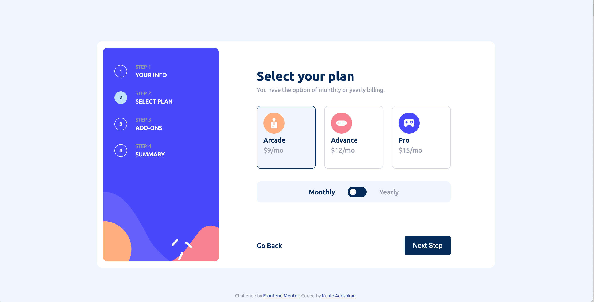

# Frontend Mentor - Multi-step form solution

This is a solution to the [Multi-step form challenge on Frontend Mentor](https://www.frontendmentor.io/challenges/multistep-form-YVAnSdqQBJ). Frontend Mentor challenges help you improve your coding skills by building realistic projects.

## Table of contents

- [Overview](#overview)
  - [The challenge](#the-challenge)
  - [Screenshot](#screenshot)
  - [Links](#links)
- [My process](#my-process)
  - [Built with](#built-with)
  - [What I learned](#what-i-learned)
  - [Continued development](#continued-development)
  - [Useful resources](#useful-resources)
- [Author](#author)

## Overview

This project is a multi-step form that allows users to select a package and subscribe to an online gaming service. The form is broken up into 4 steps: 1) Fill in a form, 2) Select a plan, 3) Select add-ons, and 4) Review and confirm the order. The user can go back to a previous step to update their selections. The final step shows a summary of the user's selections and allows them to confirm their order.

### The challenge

Users should be able to:

- Complete each step of the sequence
- Go back to a previous step to update their selections
- See a summary of their selections on the final step and confirm their order
- View the optimal layout for the interface depending on their device's screen size
- See hover and focus states for all interactive elements on the page
- Receive form validation messages if:
  - A field has been missed
  - The email address is not formatted correctly
  - A step is submitted, but no selection has been made

### Screenshot



### Links

- Solution URL: [Solution](https://www.frontendmentor.io/solutions/multistep-form-sOS9BnMP-V)
- Live Site URL: [Multi-step Form](https://kunle-coded.github.io/multi-step-form/)

## My process

### Built with

- Semantic HTML5 markup
- CSS custom properties
- Flexbox
- Javascript

### What I learned

<!-- q: Write about what I learned in this project -->

I learned how to use the HTML5 form validation API to validate user input. I also learned how to use the HTML5 progress element to show the user's progress through the form. I also learned how to use the HTML datasets attribute to dynamically add elements based on the datasets values.

Most specifically, I learned how to style a checkbox, based on its state - checked or unchecked.

```html
<div class="progress-bar__step" data-step="0">
  <div class="progress-bar__step__circle ">1</div>
  <div class="progress-bar__step__text">Your info</div>
</div>
```

```css
input[type='checkbox']:checked {
  accent-color: var(--global-accent-color);
}
```

```js
const validateForm = () => {
  const formInputs = document.querySelectorAll('.main--section-form input');
  let formValid = true;

  formInputs.forEach(input => {
    const error = input.previousElementSibling.lastElementChild;

    if (input.value === '') {
      formValid = false;

      error.style.visibility = 'visible';
      input.classList.add('invalid');
    } else if (input.name === 'email') {
      if (!input.value.includes('@') || !input.value.includes('.')) {
        formValid = false;

        error.style.visibility = 'visible';
        input.classList.add('invalid');
      }
    } else {
      error.style.visibility = 'hidden';
      input.classList.remove('invalid');
    }
  });

  return formValid;
};
```

### Continued development

I want to create an e-commerce project, because that allow me practice more advance topics in HTML, CSS and JavaScript

### Useful resources

- [Figma](https://www.figma.com) - This helped me to have a closer idea of sizes and positions of the individual elements on the page since I only had images from the challenge. I really liked this pattern and will use it going forward.
- [mdn web docs](https://developer.mozilla.org/en-US/docs/) - I explored this severally throughout the project to have a deeper understanding of certain concepts.

## Author

- Website - [Adekunle Adesokan](https://github.com/kunle-coded)
- Frontend Mentor - [@yourusername](https://www.frontendmentor.io/profile/kunle-coded)
- Twitter - [@kunle_ronald](https://www.twitter.com/kunle_ronald)
